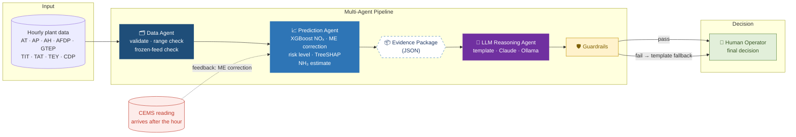
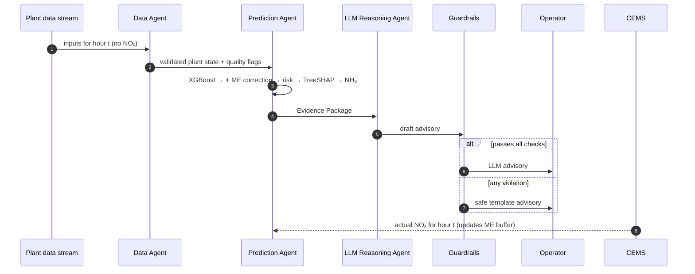

<div align="center">

# 🌿 EcoReason AI

### An Intelligent Multi-Agent System for Proactive NOₓ Emission Control in Thermal Power Plants


*M.Sc. Data Science dissertation · Vellore Institute of Technology, Chennai*

</div>

---

EcoReason AI turns hourly gas-turbine operating data into **grounded, explainable advisories** for plant operators.
It predicts NOₓ before the CEMS reading arrives, corrects long-term drift, explains each prediction, estimates the
ammonia (NH₃) an SCR would need, and lets an LLM write a short advisory. Every advisory is checked by safety
guardrails, and **the operator always makes the final decision**. The system never controls plant equipment.

## Contents
- [Architecture](#-architecture)
- [How one hour is processed](#-how-one-hour-is-processed)
- [Agents](#-agents)
- [Results](#-results)
- [Quick start](#-quick-start)
- [Project structure](#-project-structure)
- [Configuration](#-configuration)
- [Ammonia (NH₃) estimation](#-ammonia-nh₃-estimation)
- [Safety guardrails](#-safety-guardrails)
- [Limitations](#-limitations)
- [Dataset & references](#-dataset--references)

---

## 🏗 Architecture




**Observe → Predict → Reason → Decide.** All numbers are produced by the ML side; the LLM only explains them.

## 🔄 How one hour is processed



## 🤖 Agents

| Component | File | Responsibility |
|---|---|---|
| **Data Agent** | `ecoreason/agents/data_agent.py` | Streams hourly observations, flags missing / out-of-range / frozen inputs, keeps plant state (`OK · WARNING · INVALID`). Never sees the current hour's NOₓ. |
| **Prediction Agent** | `ecoreason/agents/prediction_agent.py` | XGBoost NOₓ prediction → rolling 24 h Mean-Error correction → risk level (LOW / MEDIUM / HIGH + rising-trend early warning) → TreeSHAP contributors → indicative NH₃ requirement. Rejects gap-filled CEMS readings from the ME buffer. |
| **Evidence Package** | `ecoreason/evidence.py` | Structured JSON: the only input the LLM receives. |
| **LLM Reasoning Agent** | `ecoreason/agents/reasoning_agent.py` | Writes a short, conservative advisory. Backends: `template` (offline), `anthropic` (Claude API), `ollama` (free local model). |
| **Guardrails** | `ecoreason/guardrails.py` | Validates every advisory; falls back to the template on any violation. |
| **Orchestrator** | `ecoreason/pipeline.py` | Runs the loop, times each stage, logs everything. |
| **Evaluation** | `ecoreason/evaluate.py` | Prediction, alert, latency, safety and NH₃ metrics + report. |

## 📊 Results

Protocol: model selection on 2011–12 → 2013; final model trained on **2011–2013**, replayed hour by hour on **2014–2015 (14,542 hours)**.

**Model comparison (validation 2013)**

| Model | RMSE (mg/m³) | R² |
|---|---|---|
| **XGBoost** | **7.43** | **0.62** |
| Random Forest | 7.65 | 0.60 |
| KNN | 8.00 | 0.56 |
| MLR | 10.63 | 0.22 |

**Temporal drift & Mean Error correction (XGBoost, test 2014–2015)**

| Method | MAE | RMSE | R² | ME |
|---|---|---|---|---|
| No correction | 11.11 | 12.62 | −0.43 | −10.57 |
| **+ 24 h ME correction** | **3.40** | **5.13** | **0.76** | **≈ 0** |
| Persistence baseline (y[t−1]) | 2.34 | 5.03 | 0.77 | ≈ 0 |

> Persistence is hard to beat on average because NOₓ changes slowly. The model's advantage is during load changes
> (MAE 4.5 vs 7.5 mg/m³), plus explainability and a backup estimate when the CEMS is unavailable.

**Agentic system**

| Metric | Value |
|---|---|
| Alert precision / recall (MEDIUM or HIGH) | 0.71 / 0.73 |
| HIGH-NOₓ episodes flagged at onset | 85% of 199 |
| False alarms | 0.62 per day |
| End-to-end latency | ≈ 10 ms per hour |
| Advisories passing guardrails | 100% |
| Advance NH₃ estimate vs requirement from actual NOₓ | MAE 1.15 mg/m³, bias +0.02 |

<p align="center">
  <br/>
  <br/>
  
</p>

**What influences NOₓ (TreeSHAP, 2014–2015):** ambient temperature (AT) has the largest influence (≈ 5.7 mg/m³ per hour);
higher AT and higher humidity (AH) go with lower predicted NOₓ; high turbine inlet temperature (TIT) can raise it by up
to ≈ 6.6 mg/m³. These are predictive associations, not proven physical causes.

## 🚀 Quick start

```bash
git clone https://github.com/<your-username>/ecoreason-ai.git
cd ecoreason-ai
pip install -r requirements.txt

python run.py train                  # train model → artifacts/ (~10 s)
python run.py demo                   # one HIGH-risk hour: evidence package + advisory
python run.py replay                 # full 2014–2015 replay + evaluation (~2.5 min)
python run.py replay --limit 500     # quick run
python run.py evaluate               # re-evaluate the latest run
python run.py test                   # guardrail red-team tests
```

**Using a real LLM** (only MEDIUM / HIGH hours are sent to it):

```bash
# Claude
export ANTHROPIC_API_KEY=sk-ant-...        # Windows: set ANTHROPIC_API_KEY=...
python run.py replay --llm anthropic --limit 300 --verbose

# Free local model via Ollama (https://ollama.com)
ollama pull llama3.1:8b
python run.py replay --llm ollama --limit 300 --verbose
```

**Phase 1 notebook:** `notebooks/01_EcoReason_Phase1_ML_Pipeline.ipynb` covers EDA, model comparison, temporal
validation, ME correction and feature importance.

<details>
<summary><b>Example output of <code>python run.py demo</code></b></summary>

```text
SUMMARY    : Predicted NOₓ for 2014-h0077: 83.61 mg/m³ (model 75.64 mg/m³, ME correction +7.97). Risk level: HIGH.
EXPLANATION: Largest predictive contributors this hour: AT (12.36 °C) raises the prediction by 3.93 mg/m³;
             TIT (1066.8 °C) raises it by 1.02 mg/m³; GTEP (23.22 mbar) raises it by 0.98 mg/m³.
             These are associations learned from historical data, not confirmed physical causes.
ADVISORY   : HIGH predicted NOₓ: review the current operating condition of TIT and GTEP and confirm against the
             CEMS reading when it arrives. Indicative NH₃ requirement to bring NOₓ to 50 mg/m³: 12.44 mg NH₃ per m³
             of flue gas (removal of 33.61 mg/m³, 40.2%). Actual dosing is decided by the SCR control system and
             the operator.
Guardrails passed: True  |  CEMS value that arrived afterwards: 91.57 mg/m³
```
</details>

## 📁 Project structure

```text
ecoreason-ai/
├── run.py                      # CLI: train · demo · replay · evaluate · test
├── config.yaml                 # all settings (data, model, risk, ammonia, LLM)
├── requirements.txt
├── ecoreason/
│   ├── config.py               # config + data loading
│   ├── train.py                # Stage 0: model, scaler, thresholds, global importance
│   ├── evidence.py             # PlantState, EvidencePackage
│   ├── guardrails.py           # safety & grounding checks
│   ├── pipeline.py             # orchestrator
│   ├── evaluate.py             # metrics + report
│   └── agents/
│       ├── data_agent.py
│       ├── prediction_agent.py
│       └── reasoning_agent.py
├── tests/test_guardrails.py    # 14 red-team tests
├── notebooks/                  # Phase 1 ML notebook
├── data/                       # UCI gt_2011.csv … gt_2015.csv
├── artifacts/                  # trained model, scaler, meta.json
├── outputs/                    # replay runs: hourly_results.csv, report.md, metrics.json, plots
└── docs/                       # figures used in this README
```

## ⚙️ Configuration

Everything is set in `config.yaml`. To use another plant's data, change only the `data` block, `units` and
`ambient_features`, then run `python run.py train`.

| Key | Default | Meaning |
|---|---|---|
| `data.train_years` / `replay_years` | 2011–13 / 2014–15 | chronological split |
| `me_correction.window_hours` | 24 | rolling window of past CEMS residuals |
| `risk.mode` | `percentile` | P75 → MEDIUM (74.6), P90 → HIGH (82.1 mg/m³); or `absolute` limits |
| `risk.trend_alert_slope` | 3.0 mg/m³/h | early-warning escalation |
| `ammonia.target_nox` | 50 mg/m³ | NOₓ target after SCR |
| `ammonia.nsr` | 1.0 | NH₃ : NOₓ molar ratio |
| `ammonia.flue_gas_flow_nm3_per_h` | `null` | set to also get NH₃ in kg/h |
| `llm.backend` | `template` | `template` · `anthropic` · `ollama` |
| `llm.call_on` | `[MEDIUM, HIGH]` | risk levels sent to the LLM |

## 🧪 Ammonia (NH₃) estimation

SCR reaction: **4 NO + 4 NH₃ + O₂ → 4 N₂ + 6 H₂O**

```text
NH₃ (mg/m³) = max(0, NOₓ_predicted − NOₓ_target) × 17.03 / 46.01 × NSR      (NOₓ expressed as NO₂)
```

Example: 83.61 → 50 mg/m³ ⇒ remove 33.61 mg/m³ ⇒ **12.44 mg NH₃ per m³** of flue gas
(≈ 12.4 kg/h for every 1 million m³/h of flue gas).

> ⚠️ This is a **stoichiometric estimate, not a dosing set-point**. The UCI dataset has no SCR or NH₃ measurements,
> so it cannot be validated against real dosing. Real dosing also depends on catalyst activity, temperature and NH₃ slip.

## 🛡 Safety guardrails

Every advisory (LLM or template) is validated before it reaches the operator. It is rejected if it:

| Check | Example that is blocked |
|---|---|
| Invents numbers not in the evidence | "NOₓ will reach 97.3 mg/m³ next hour" |
| Claims physical causality | "High TIT caused the NOₓ increase" |
| Gives control or dosing commands | "Operators should reduce TIT" · "Inject more NH₃" |
| Mentions unmeasured variables | "Check the O₂ level and fuel flow" |
| States a different risk level | "low risk" when the evidence says HIGH |
| Hides a data-quality warning | out-of-range inputs not mentioned |

Rejected or unparseable LLM output falls back to the deterministic template. `python run.py test` runs 14 red-team cases.

## ⚠️ Limitations

- Hourly **historical replay**, not a live DCS connection.
- Estimates the **current hour's** NOₓ before the CEMS value arrives; not a multi-hour forecast.
- Risk thresholds are data-driven (P75 / P90), not regulatory limits.
- NH₃ requirement is theoretical and unvalidated (no SCR data).
- Single CCGT plant dataset; some CEMS stretches in the data are gap-filled.

## 📚 Dataset & references

**Dataset:** [UCI Gas Turbine CO and NOx Emission Data Set](https://archive.ics.uci.edu/dataset/551/gas+turbine+co+and+nox+emission+data+set):
36,733 hourly records from a CCGT plant in Turkey, 2011–2015.

1. Kaya, H., Tüfekci, P., & Uzun, E. (2019). Predicting CO and NOx emissions from gas turbines: novel data and a benchmark PEMS. *Turkish Journal of Electrical Engineering & Computer Sciences*, 27(6), 4783–4796.
2. Wood, D. A. (2023). Long-term atmospheric pollutant emissions from a combined cycle gas turbine: Trend monitoring and prediction applying machine learning. *Fuel*, 343, 127722.
3. Chen, T., & Guestrin, C. (2016). XGBoost: A scalable tree boosting system. *Proc. 22nd ACM SIGKDD*, 785–794.
4. Lundberg, S. M., et al. (2020). From local explanations to global understanding with explainable AI for trees. *Nature Machine Intelligence*, 2, 56–67.
